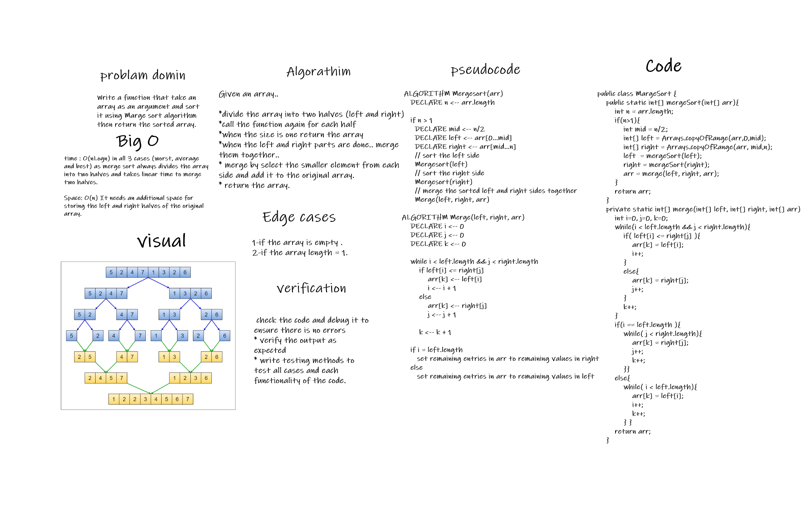

# Marge sort
# Challenge Summary

* Write a function that take an array as an argument and sort it using Marge sort algorithm then return the sorted array.
  Need add the following method:
* 
* `mergeSort(array)`
  this method will take an array as an argument and sort it using Marge sort algorithm then return the sorted array. and will care about the following cases.

  * If the array is empty => return an empty array.
  * If the array size is one => return the array immediately
  * else.. sort the array inplace and return it.

* `merge(left,right,arr)`
  * this method will take three arrays as arguments and merge the first two together into the third one
    (merge left and right into => arr)

# Solution ( whiteboared ):

## Approach & Efficiency

***Merge Sort:***

Given an array..

* divide the array into two halves (left and right)
* call the function again for each half
* when the size is one return the array
* when the left and right parts are done.. merge them together..
* merge by select the smaller element from each side and add it to the original array.
* return the array.

## Big-O:
- Time: O(n log n): it has to divide the array every time into two sub arrays and loop over the values in order to merge them.
- Space : O(n).

# Solution

# [Marge sort blog =>](./BLOG.md)

# [Source code =>](./lib/src/main/java/margeSort/MargeSort.java)

