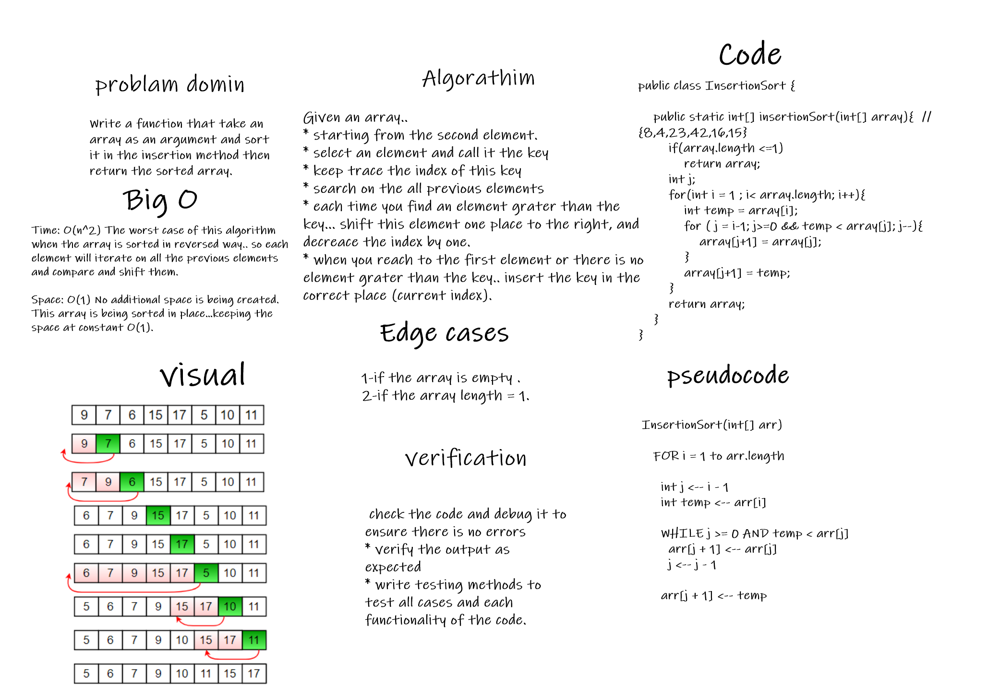

# Insertion sort
# Challenge Summary

* Write a function that take an array as an argument and sort it in the insertion method then return the sorted array.
  Need add the following method:

* `insertionSort(array)`
  this method will take an array as an argument and and sort it in the insertion method then return the sorted array, and will care about the following cases.

* If the array is empty => return an empty array.
* If the array size is one => return the array immediately
* else.. sort the array inplace and return it.

# Solution ( whiteboared ):

## Approach & Efficiency

***Insertion Sort:***

Given an array..

* starting from the second element.
* select an element and call it the key
* keep trace the index of this key
* search on the all previous elements
* each time you find an element grater than the key... shift this element one place to the right, and decreace the index by one.
* when you reach to the first element or there is no element grater than the key.. insert the key in the correct place (current index).

# Solution

# [insertion sort blog =>](./BLOG.md)

# [Source code =>](./lib/src/main/java/insertionSort/InsertionSort.java)

