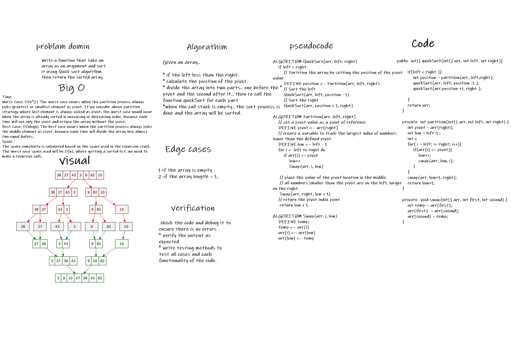

# Marge sort
# Challenge Summary

* Write a function that take an array as an argument and sort it using Quick sort algorithm then return the sorted array.
 *  Need add the following method:

* `quickSort(array,left,right)`
  this method will take the (array , left , right) as an argument and  sort it using Quick sort algorithm then return the sorted array. and will care about the following cases.

  * If the array is empty => return an empty array.
  * If the array size is one => return the array immediately
  * else.. sort the array inplace and return it.

* `partition(arr,left,right)`
  * this method will put the pivot on its correct order where all the smallest elements than it will be on its left side and all the largest elements on its right side.. then, return the position of the pivot.

* `swap(arr,first,second)`
  * this method will simply swap the element in the first index with the element in the second index.
  
# Solution ( whiteboared ):

## Approach & Efficiency

***Quick Sort:***

Given an array..

* if the left less than the right.
* calculate the position of the pivot.
* divide the array into two parts.. one before the pivot and the second after it.. then re call the function quickSort for each part
* when the call stack is empty.. the sort process is done and the array will be sorted.

## Big-O:
- **Time:** 
* Worst Case: O(n^2) The worst case occurs when the partition process always picks greatest or smallest element as pivot. If we consider above partition strategy where last element is always picked as pivot, the worst case would occur when the array is already sorted in increasing or decreasing order, because each time will cut only the pivot and return the array without the pivot.
* Best Case: O(nlogn) The best case occurs when the partition process always picks the middle element as pivot, because each time will divide the array into almost two equal halves.
- **Space :**
* The space complexity is calculated based on the space used in the recursion stack. The worst case space used will be O(n). where getting a sorted list, we need to make n recursive calls.

# Solution

# [Quick sort blog =>](./BLOG.md)

# [Source code =>](./lib/src/main/java/quickSort/QuickSort.java)

