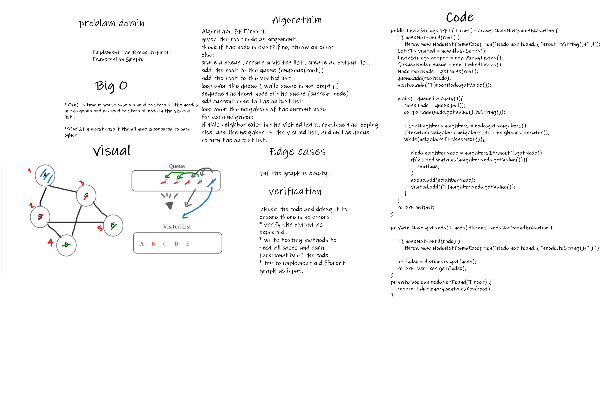

# BFT On graph.
# Challenge Summary

Implement the Breadth-First-Traversal on Graph.
* **`BFT(root)`** this method should take the value of root to start the traversing from it, and will return list of strings that represents the order of traversing the all connected nodes to the given root.
***NOTE:*** if the node is not exist will throw an exception (NodeNotFoundException)

## Whiteboard Process

## Approach & Efficiency

***Algorithm: BFT(root):***

* given the root node as argument.
* check if the node is exist?
  * if no, throw an error
* else:
  * crate a queue
  * create a visited list.
  * create an output list.
  * add the root to the queue (enqueue(root))
  * add the root to the visited list
  * loop over the queue ( while queue is not empty )
    * dequeue the front node of the queue (current node)
    * add current node to the output list
    * loop over the neighbors of the current node
    * for each neighbor:
      * if this neighbor exist in the visited list?.. continue the looping
      * else, add the neighbor to the visited list, and on the queue
  * return the output list.

***Efficiency:***

`Time`:

* `O(V+E)`:
  where `V` is the number of nodes connected to the given root, where we need to visit them all.

And `E` is the number of Edges in the graph (or part of graph connected to the root)

`space`:

* `O(V)`:
  where `V` is the number of nodes connected to the given root, So we need to create visited list and output list and queue of size (V), overall space will be `O(V)`

## Solution

[Source code =>](../app/src/main/java/graph/Graph.java)