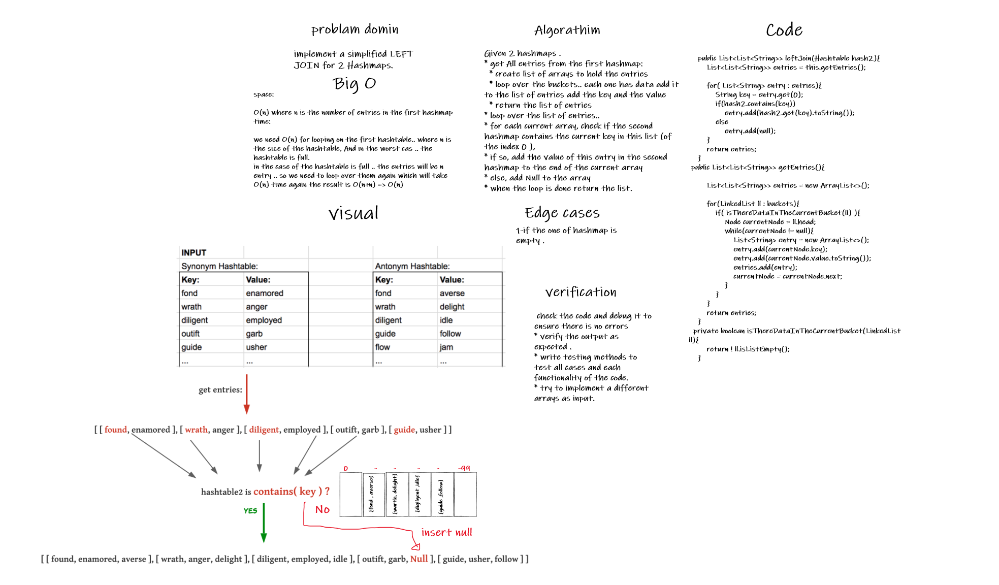

# Hashmap LEFT JOIN
[Source code =>](../app/src/main/java/hash/table/Hashtable.java)
* implement a simplified LEFT JOIN for 2 Hashmaps.
## Challenge
* we need create :-
* leftJoin(hashtable2) this method should apply by hashtable1 and should take the hashtable2 as an argument, and will return list of arrays that represents the entries of the first hashmap left joined to the hashmap2.
* getEntries() this method should run by a hashmap and will return list of arrays contains the entries of this map where the first element in each array represent the key of this entry and the second element represent the value.

## Approach & Efficiency

***implement a LEFT Join for 2 hashmaps:***

* get All entries from the first hashmap:
  * create list of arrays to hold the entries
  * loop over the buckets.. each one has data add it to the list of entries add the key and the value
  * return the list of entries
* loop over the list of entries..
* for each current array, check if the second hashmap contains the current key in this list (of the index 0 ),
* if so, add the value of this entry in the second hashmap to the end of the current array
* else, add Null to the array
* when the loop is done return the list.

***Efficiency:***

**`space:`**

* `O(n)` where n is the number of entries in the first hashmap

**`time:`**

* we need `O(n)` for looping on the first hashtable.. where n is the size of the hashtable, And in the worst cas .. the hashtable is full.
* in the case of the hashtable is full .. the entries will be n entry .. so we need to loop over them again which will take `O(n)` time again
  the result is O(n+n) => `O(n)`
## Solution

