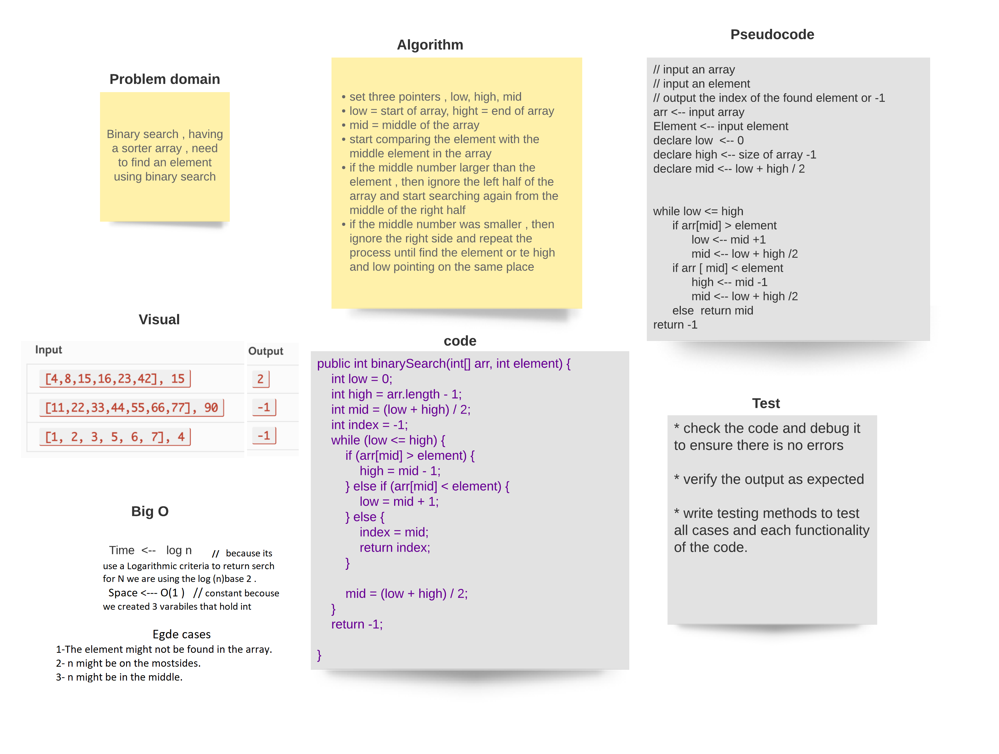

# Binary Search of Sorted Array
find an element in a sorted array using binary search algorithm

## Whiteboard Process

## Approach & Efficiency
start comparing the element with the middle element in the array if the middle number larger than the element , then ignore the left half of the array and start searching again from the middle of the right half if the middle number was smaller , then ignore the right side and repeat the process until find the element or te high and low pointing on the same place