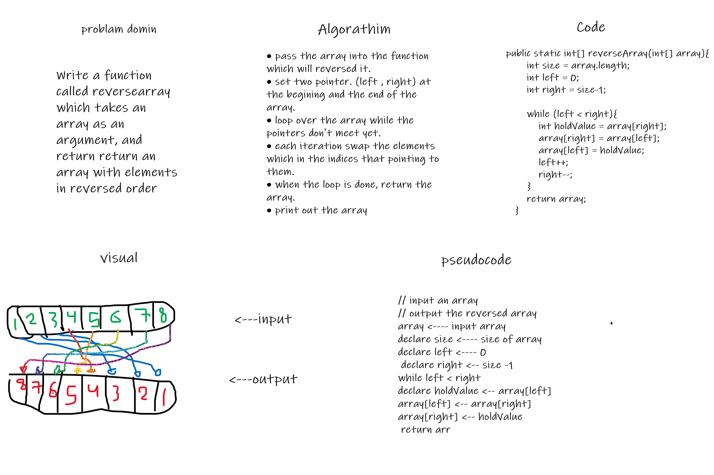

# Reverse an Array
* print an array with the reserved elments in the array.

## Whiteboard Process

## Approach & Efficiency
The approach is creating a new array, which it will contain the reserved values of original array ,By looping through it.