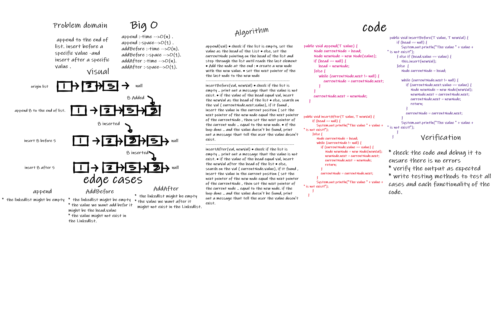

 ## Challenge Summary
More implementaitons on linked list, like (insert before, insert after, append).
we Need add the following methods:

addBefore(val, newVal): to search and add a new value before a specific one.  
addAfter(val, newVal): to search and add a new value after a specific one.
append(val): to add a new value to the end of the list.

## Whiteboard Process

## Approach & Efficiency

with the (addBefore AND addAfter) methods, will start from the head and search on the specific value, if it found.. add the new value before or after it. If not, then print out a message or exception that tell the user the value is not exist.

the append method: start from head and step through the last element, then add the new value there.
append :-time -->O(n) .
addBefore :-time -->O(n).
addAfter :-time -->O(n).

## Solution
* [code files ](../lib/src/main/java/linked/list/LinkedList.java)
* [code test files ](../lib/src/test/java/linked/list/LibraryTest.java)