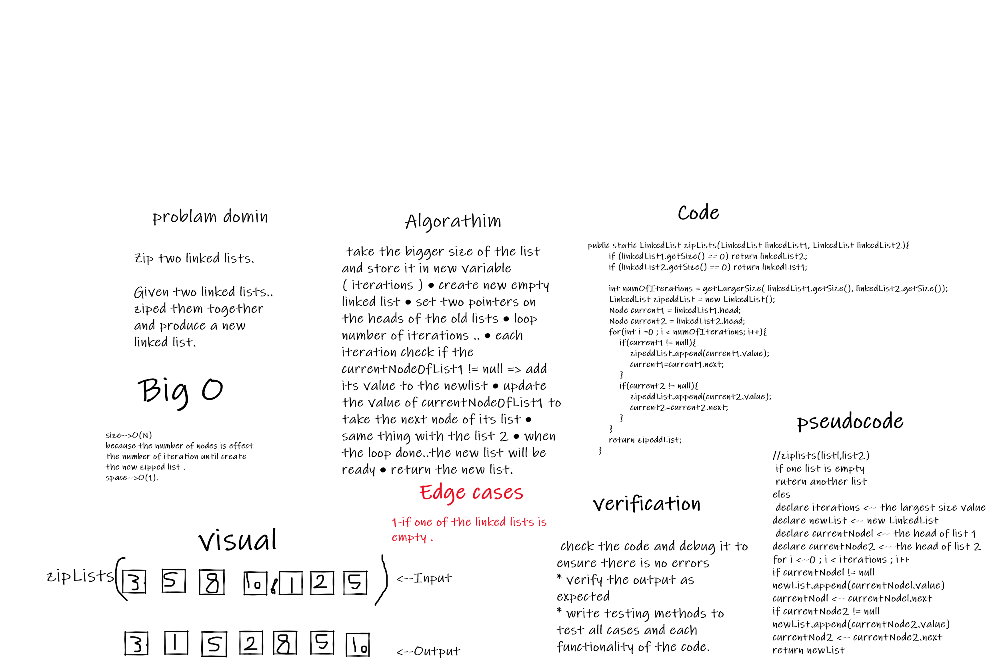

 ## Challenge Summary
declare a method to zipped two list together into new one.
Need add the following methods:
zippedList(linkedList1, linkedList2) this method should take two linked list and produce a new one which contain the all elements of them.

## Whiteboard Process

## Approach & Efficiency

take the bigger size of the list and store it in new variable ( iterations )
create new empty linked list
set two pointers on the heads of the old lists
loop number of iterations ..
each iteration check if the currentNodeOfList1 != null => add its value to the newlist
update the value of currentNodeOfList1 to take the next node of its list
same thing with the list 2
when the loop done..the new list will be ready
return the new list.

Big o :-time -->O(n) .
Big o :-space -->O(1).

## Solution
* [code files ](../lib/src/main/java/linked/list/LinkedList.java)
* [code test files ](../lib/src/test/java/linked/list/LibraryTest.java)