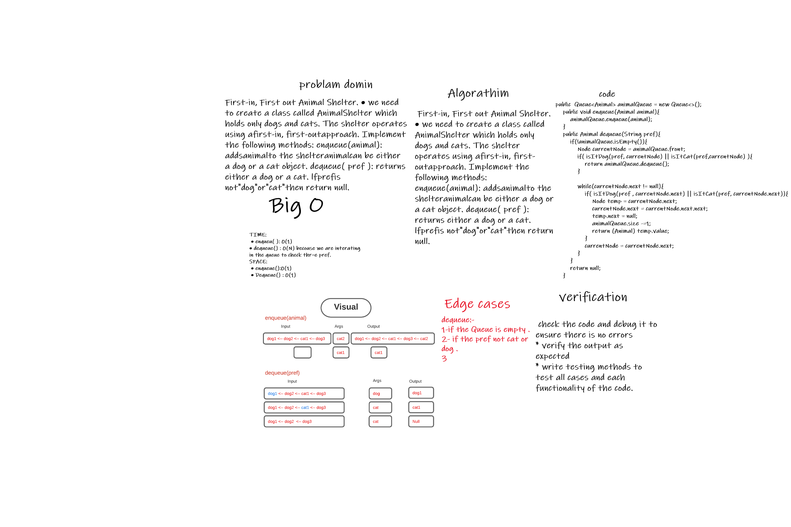

# Challenge Summary
First-in, First out Animal Shelter.
### Need add the following methods:

* `enqueue(Animal)`
  this method should add an Animal (Dog OR Cat) into the queue which represents the Animal shelter.
* `dequeue(pref)`
  this method should retrieve the pref type of Animal (Dog Or Cat) which enter the queue first.

## Whiteboard Process

## Approach & Efficiency
* ***enqueue(Animal):***
    * Will act the same ad  the enqueue method of the queue which we already have.

* ***dequeue(pref):***

1. will compare if the pref value is a dog and if the front animal is dog => then return this animal
2. OR if the pref value is a cat nad if the front animal is a cat => return this animal

* Else, while the next node not null:
  check again the steps `1,2` but with the value of the `next node` .
* if the loop done without find any mathced value.. return null.

* Big O :enqueue --> time O(1), space O(1);
* dequeue --> time O(N), space O(1);

## Solution
[code](../lib/src/main/java/stackAndQueue/AnimalShelter.java)
