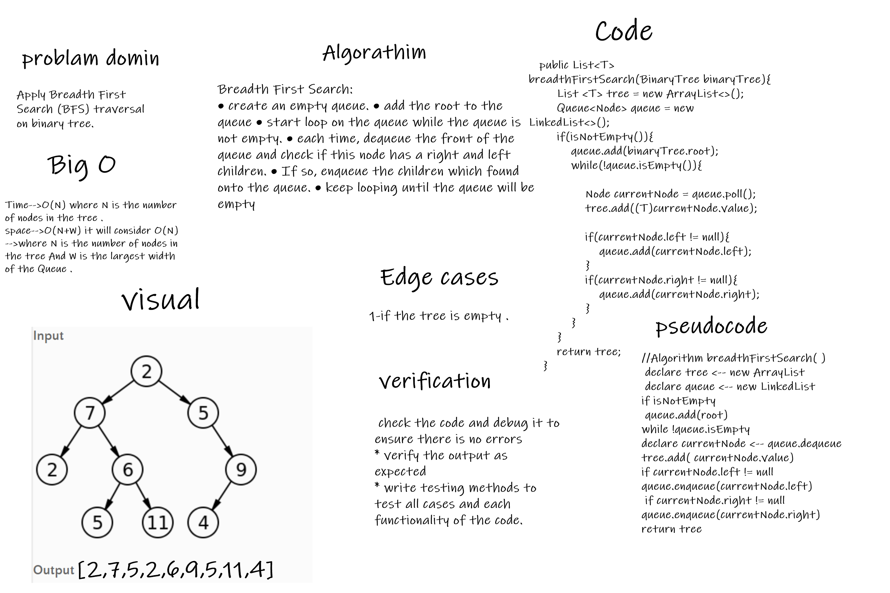

# # Trees: Breadth First Search Traversal method
# Challenge Summary
*Implement a method to traverse the binary tree in A BFS(Breadth First Search) order.
* Need add the following method:
* `breadthFirstSearch(tree)`
   * this method should return list which contain the all values of the tree in the BFS order.

## Whiteboard Process

## Approach & Efficiency
***Breadth First Search (BFS):***

* create an empty queue.
* add the root to the queue
* start loop on the queue while the queue is not empty.
* each time, dequeue the front of the queue and check if this node has a right and left children.
* If so, enqueue the children which found onto the queue.
* keep looping until the queue will be empty
### Big o 
  - **of time** = O(N) where N is the number  of the Node in the tree .
  - **of space** =O(N+W) it will consider O(N) -->where N is the number of nodes in the tree And W is the largest width of the Queue . 
## Solution
[source code](../lib/src/main/java/trees/BinaryTree.java)

