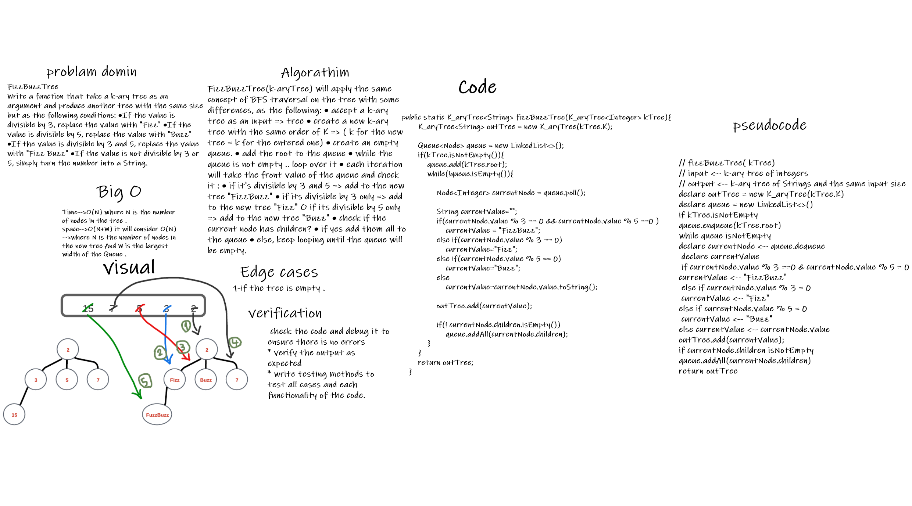

# Trees: FizzBuzzTree(k-aryTree)
# Challenge Summary
*Write a function that take a k-ary tree as an argument and produce another tree with the same size with some edits.
* Need add the following method:
* `fizzBuzzTree(k-aryTree)`
  this method will take a k-ary tree as an argument and produce another tree with the same size but as the following conditions:

* If the value is divisible by 3, replace the value with “Fizz”
* If the value is divisible by 5, replace the value with “Buzz”
* If the value is divisible by 3 and 5, replace the value with “FizzBuzz”
* If the value is not divisible by 3 or 5, simply turn the number into a String.

## Whiteboard Process

## Approach & Efficiency
***FizzBuzzTree(k-aryTree)***

> will apply the same concept of BFS traversal on the tree with some differences, as the following:
* accept a k-ary tree<intrger> as an input => kTree
* create a new k-ary tree with the same value of K => ( k for the new tree = k for the entered one)
* create an empty queue.
* add the root to the queue
* while the queue is not empty .. loop over it
* each iteration will take the front value of the queue and check it :
  * if it's divisible by 3 and 5 => add to the new tree "FizzBuzz"
  * if it's divisible by 3 only => add to the new tree "Fizz"
  * if it's divisible by 5 only => add to the new tree "Buzz"
* check if the current node has children?
* if yes add them all to the queue
* else, keep looping until the queue will be empty.
### Big o 
  - **of time** = O(N) where N is the number  of the Node in the tree .
  - **of space** =O(N+W) it will consider O(N) -->where N is the number of nodes in the new tree And W is the largest width of the Queue . 
## Solution
[source code](../lib/src/main/java/k_aryTree/K_aryTree.java)

